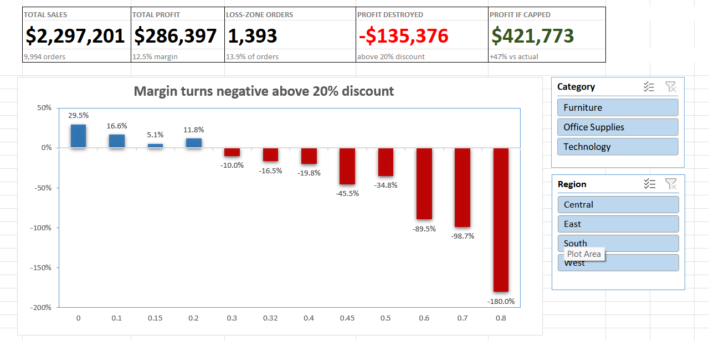
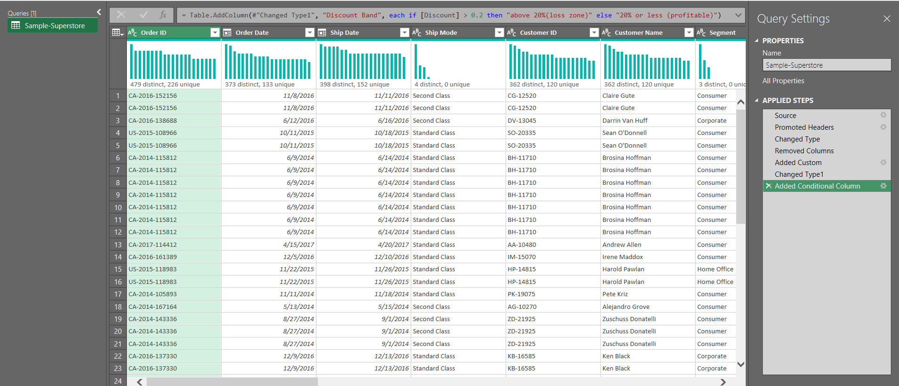
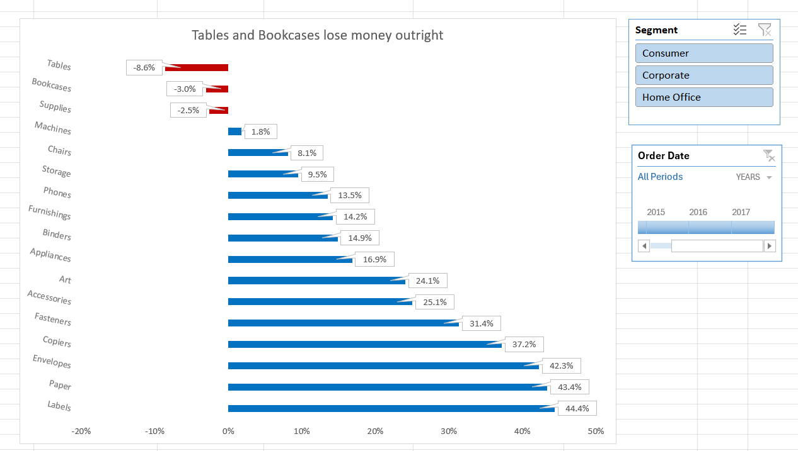

# Discount Effectiveness & Margin Leakage Analysis

Testing whether discounting actually buys the business anything — 9,994 real retail orders, analysed end-to-end in Excel with Power Query and PivotTables.

**Headline finding: 13.9% of orders are discounted above 20%. Every one of those discount levels loses money. Capping discounts at 20% would raise profit by 47% — from $286K to $422K — while giving up only 16% of revenue.**

---

## Business Problem

Discounting is the most common lever in retail and the least examined. The standard assumption is that a discount buys volume, and volume covers the margin given away.

Nobody checks, because checking requires connecting discount rate to **profit** — and almost every sales dashboard reports **revenue**. Revenue behaves exactly as expected when you discount: it goes up. The damage is invisible unless you look at margin.

This project asks one question: **at what discount level does the business stop making money, and what is that costing?**

---

## Tools Used

- **Excel** — PivotTables, calculated fields, PivotCharts, slicers, timeline
- **Power Query** — repeatable cleaning pipeline: typed columns, removed unused fields, derived `Profit Margin` and `Discount Band`

Every cleaning step is recorded and replayable. New data drops in, hit Refresh, and the entire dashboard rebuilds — no manual rework.

---

## Data Source

[Sample Superstore](https://www.kaggle.com/datasets/vivek468/superstore-dataset-final) — 9,994 US retail orders, 2014–2017, with order-level `Sales`, `Quantity`, `Discount`, and `Profit`, plus customer segment, region, and product category.

---

## Key Findings

### 1. Margin turns negative above a 20% discount — with no exceptions

| Discount | Profit Margin | Discount | Profit Margin |
|---|---|---|---|
| 0% | **+29.5%** | 32% | −16.5% |
| 10% | **+16.6%** | 40% | −19.8% |
| 15% | **+5.1%** | 45% | −45.5% |
| 20% | **+11.8%** | 50% | −34.8% |
| 30% | −10.0% | 60% | −89.5% |
| | | 70% | −98.7% |
| | | 80% | **−180.0%** |

Twelve discount levels. Every level at or below 20% is profitable; every level above it loses money. This is not a gradual decline — it is a threshold.

At the extreme, the 80% tier generated $16,964 in sales and **lost $30,539**. At −180% margin the company would have lost less money by giving the product away and not shipping it.

### 2. Every loss-making order in the dataset carried a discount

Of 9,994 orders, 1,871 were sold at a loss. **All 1,871 were discounted. Not a single full-price order lost money.**

Discounting is not one contributing factor among several. In this dataset it is the only mechanism by which an order becomes unprofitable.

### 3. The loss zone is small in volume and large in impact

| | Orders | Share | Sales | Profit | Margin |
|---|---|---|---|---|---|
| Discount ≤ 20% | 8,601 | 86.1% | $1,934,431 | **+$421,773** | +21.8% |
| Discount > 20% | 1,393 | 13.9% | $362,770 | **−$135,376** | −37.3% |
| **Total** | **9,994** | 100% | **$2,297,201** | **$286,397** | **12.5%** |

The company's underlying margin is 21.8%. The reported 12.5% is what remains after 14% of orders eat nearly a third of the profit.

### 4. The damage concentrates in furniture

| Sub-Category | Profit Margin | Avg. Discount |
|---|---|---|
| Tables | **−8.6%** | 26.1% |
| Bookcases | **−3.0%** | 21.1% |
| Supplies | **−2.5%** | 7.7% |
| Machines | +1.8% | 30.6% |

Tables and Bookcases are net-negative across the entire period, and both carry average discounts at or above the 20% threshold. Supplies is the exception that proves the rule — it loses money at a low average discount, so its problem is cost structure, not pricing policy.

### 5. The threshold holds in every slice of the business

A pattern that only appears in the aggregate can be an artifact of mix. This one isn't — split the data ten ways and it survives every split:

| Split | ≤ 20% discount | > 20% discount |
|---|---|---|
| **Central** | +24.8% | −40.6% |
| **East** | +25.1% | −28.9% |
| **South** | +22.3% | −35.2% |
| **West** | +17.6% | −93.9% |
| **Consumer** | +21.2% | −38.0% |
| **Corporate** | +21.7% | −40.0% |
| **Home Office** | +23.6% | −32.0% |
| **Furniture** | +13.3% | −27.9% |
| **Office Supplies** | +25.0% | −119.3% |
| **Technology** | +25.3% | −26.4% |

Four regions, three segments, three categories. Positive below the line and negative above it in all ten, without exception. This is what makes a company-wide discount cap defensible rather than a rule built on one region's numbers.

---

## A Note on Method

Profit margin here is calculated as **total profit ÷ total sales** within each group, not as the average of each order's individual margin.

Those two calculations give different answers, and the difference is not small. At the 50% discount level, averaging per-order margins returns **−54.9%**; the correct weighted figure is **−34.8%** — a 20-point gap.

Averaging ratios treats a $1 order and a $999 order as equally important. Summing first and dividing once weights each order by the money it actually represents. Implemented in Excel as a PivotTable **calculated field** (`Profit / Sales`) rather than an `Average` aggregation of a row-level margin column.

---

## Limitations

Stated plainly, because they affect how far the recommendation should be pushed:

1. **This measures transactions, not customers.** If discount-driven buyers would leave permanently when discounts are capped, the lost lifetime value is not visible in this dataset. The 47% figure is an upper bound, not a guaranteed gain.
2. **The 15% tier is a small sample.** It returns 5.1% margin — lower than the 20% tier — which breaks the otherwise smooth decline. Only ~50 orders sit at that level, versus 3,657 at 20%, so the reversal is most likely product mix rather than a real effect.
3. **Costs are implied, not itemised.** The dataset supplies profit but no cost breakdown, so discount-driven losses can't be separated from shipping or handling costs on specific items.

---

## Recommendations

1. **Cap discounts at 20%.** The 20% tier still returns 11.8% margin on $765K of sales, so the cap protects the vast majority of discounted volume. Everything above it is loss-making at every single level.
2. **Audit Tables and Bookcases before anything else.** Both are net-negative overall and both carry average discounts above the threshold. This is where a pricing rule converts directly into recovered profit.
3. **Pilot before rolling out.** Cap discounts in two regions for one quarter and track repeat-purchase rates against the untouched regions. This dataset cannot measure customer lifetime value, and a policy change that quietly costs the business its repeat buyers would be worse than the problem it solves.
4. **Report margin, not revenue, on the sales dashboard.** Every loss-making order in this dataset looked like growth on a revenue report. A dashboard that cannot show this problem is a dashboard that will let it happen again.

---

## The Dashboard

Built in Excel, fully interactive: slicers for Category, Segment, and Region plus an Order Date timeline, all connected to every PivotTable — so the 20% threshold can be tested against any slice of the business.

Open `discount-margin-analysis.xlsx` and click through. The threshold holds in every region and every segment.

---

## How to Reproduce

1. Download the [dataset](https://www.kaggle.com/datasets/vivek468/superstore-dataset-final)
2. Open `discount-margin-analysis.xlsx`
3. **Data → Queries & Connections → Refresh** to point the query at your copy of the CSV

The Power Query pipeline handles cleaning and derived columns; every PivotTable and chart rebuilds from it automatically.
